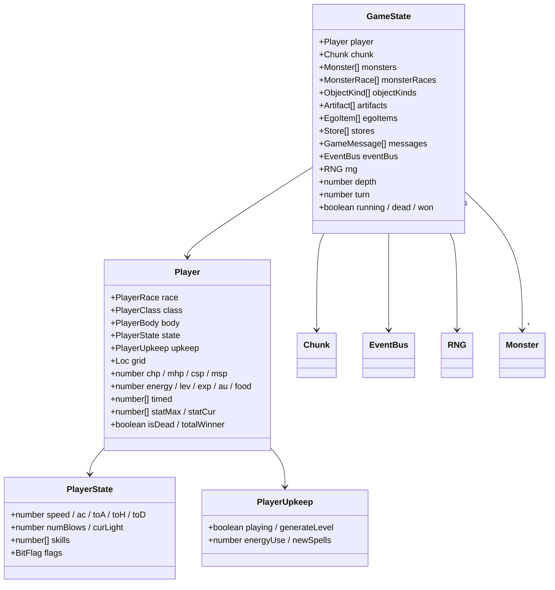
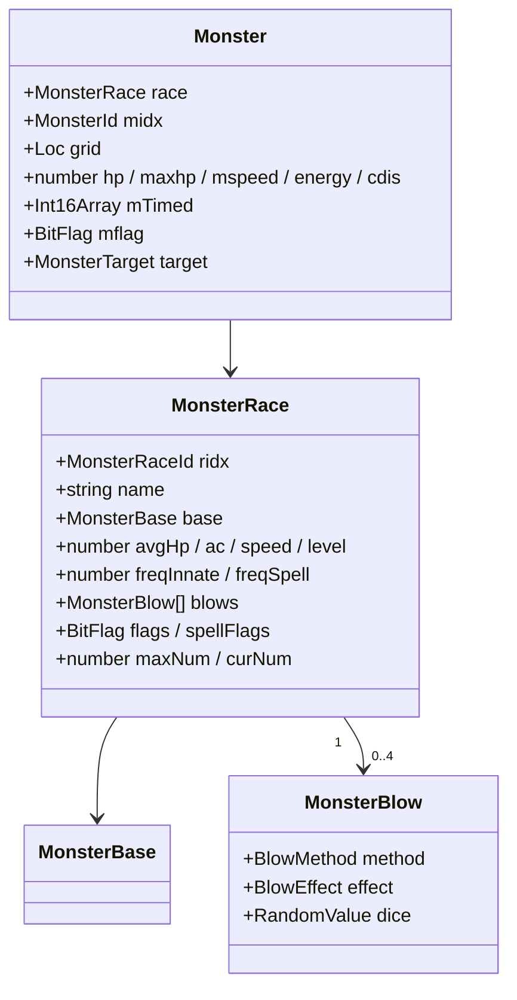
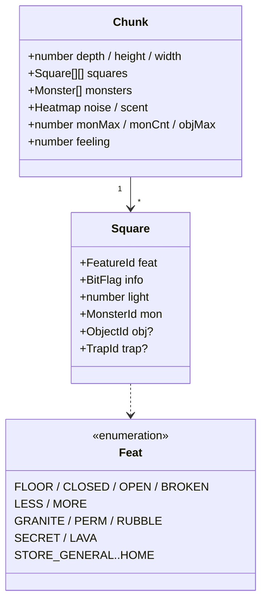
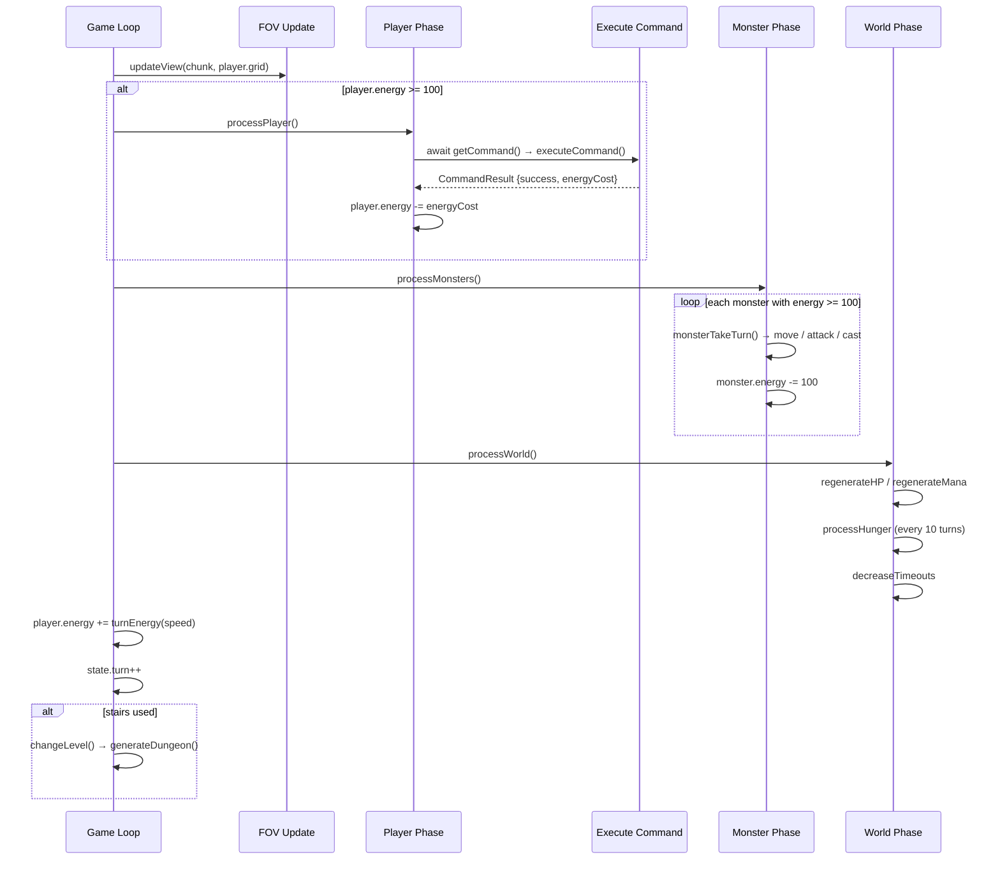
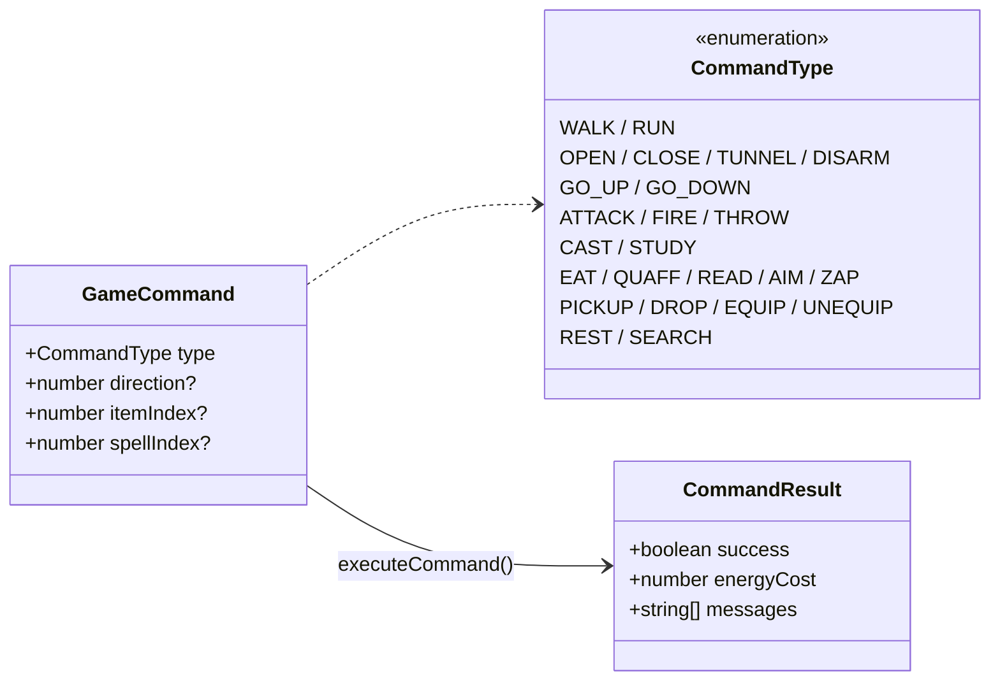
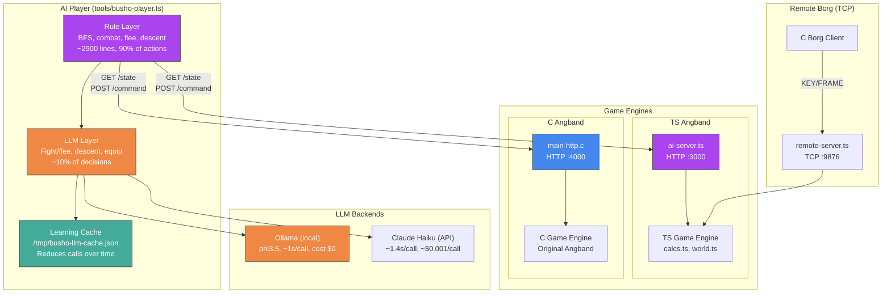
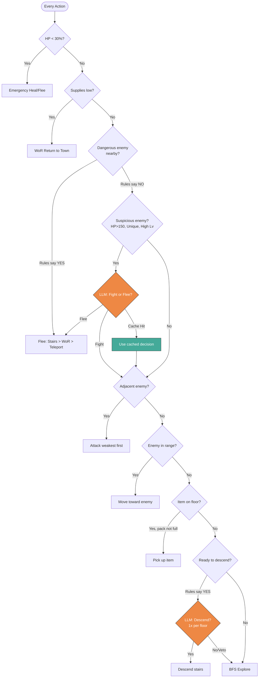
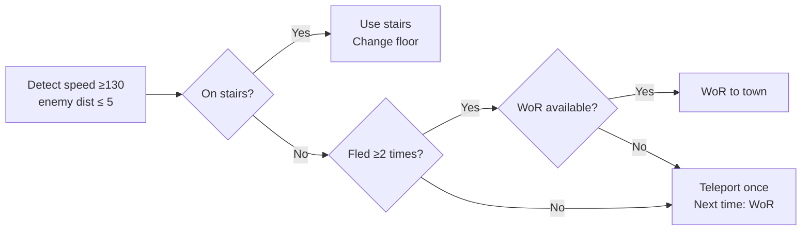
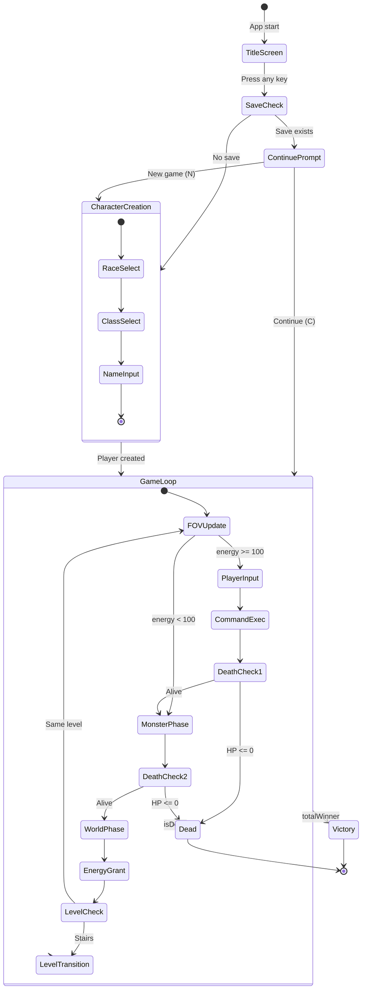

# Angband-TS Architecture

A TypeScript port of [Angband 4.2.6](https://angband.github.io/angband/). 28,583 source lines, 1,441 tests passing, playable in the browser.

---

## 1. Package Structure

```mermaid
graph TB
    subgraph "@angband/web"
        main["main.ts — Entry point"]
        bridge["game-bridge.ts — UI ↔ Core bridge"]
        kbinput["keyboard-input.ts — Keyboard input"]
        birth["birth-screen.ts — Character creation"]
        maprender["map-renderer.ts — Dungeon display"]
        storeui["store-screen.ts — Shop UI"]
        invui["inventory-ui.ts — Inventory UI"]
        spellui["spell-ui.ts — Spell selection UI"]
    end

    subgraph "@angband/renderer"
        term["terminal.ts — Virtual 80×24 grid"]
        display["display.ts — Display abstraction"]
        textblock["textblock.ts — Text block rendering"]
    end

    subgraph "@angband/core"
        subgraph "game/"
            state["state.ts — GameState"]
            world["world.ts — Game loop"]
            event["event.ts — EventBus"]
            input["input.ts — Input abstraction"]
            bootstrap["bootstrap.ts — Initialization"]
        end
        subgraph "command/"
            cmd_core["core.ts — Command dispatcher"]
            movement["movement.ts — Walk, run, stairs"]
            combat["combat.ts — Melee & ranged"]
            item_cmd["item.ts — Item use"]
            magic_cmd["magic.ts — Spellcasting"]
        end
        subgraph "monster/"
            mon_move["move.ts — AI & pathfinding"]
            mon_attack["attack.ts — Melee resolution"]
            mon_make["make.ts — Spawn & placement"]
            mon_spell["spell.ts — Monster spellcasting"]
        end
        subgraph "generate/"
            gen["generate.ts — Dungeon generation"]
            rooms["room.ts — Room carving"]
            populate["populate.ts — Monster & item placement"]
        end
        subgraph "cave/"
            chunk["chunk.ts — Chunk management"]
            square["square.ts — Square queries"]
            viewfov["view.ts — FOV (shadowcasting)"]
            pathfind["pathfind.ts — A* pathfinding"]
        end
        subgraph "object/"
            gear["gear.ts — Equipment"]
            pile["pile.ts — Item stacks"]
            slays["slays.ts — Slay & brand damage"]
        end
        subgraph "player/"
            pbirth["birth.ts — Character creation"]
            calcs["calcs.ts — Stat calculations"]
            spell["spell.ts — Spell management"]
        end
        subgraph "borg/"
            aiserver["ai-server.ts — HTTP API for AI"]
            remserver["remote-server.ts — TCP for C Borg"]
        end
        subgraph "z/"
            rng["rand.ts — RNG (WELL1024a)"]
            bitflag["bitflag.ts — BitFlag class"]
        end
    end

    subgraph "tools/"
        aiplayer["busho-player.ts — AI agent"]
        converter["data-converter/ — txt→json"]
    end

    main --> bridge
    main --> birth
    main --> bootstrap

    bridge --> world
    bridge --> kbinput
    bridge --> term
    bridge --> display

    world --> cmd_core
    world --> mon_move
    world --> mon_attack
    world --> viewfov
    world --> gen
    world --> event

    cmd_core --> movement
    cmd_core --> combat
    cmd_core --> item_cmd
    cmd_core --> magic_cmd

    gen --> chunk
    gen --> populate
    populate --> mon_make

    aiserver --> world
    aiserver --> state
    aiplayer -.->|HTTP| aiserver
    remserver --> world

    style main fill:#4a9,stroke:#333,color:#fff
    style bridge fill:#4a9,stroke:#333,color:#fff
    style world fill:#e84,stroke:#333,color:#fff
    style state fill:#e84,stroke:#333,color:#fff
    style gen fill:#48e,stroke:#333,color:#fff
    style mon_attack fill:#e44,stroke:#333,color:#fff
    style aiserver fill:#a4e,stroke:#333,color:#fff
    style aiplayer fill:#a4e,stroke:#333,color:#fff
```



---

## 2. Core Entities

### 2-1. GameState & Player



### 2-2. Monster



### 2-3. Dungeon



---

## 3. Game Loop



---

## 4. Command System



---

## 5. AI Infrastructure

### 5-1. System Overview



### 5-2. AI Player Decision Architecture



### 5-3. LLM Hybrid System

```
┌─────────────────────────────────────────────┐
│  LLM Decision Points (3 hooks)              │
├─────────────────────────────────────────────┤
│  1. Fight/Flee   — HP>150, Unique, High Lv  │
│  2. Descend      — DL15+, 1x per floor      │
│  3. Weapon Swap  — Before equipping weapon   │
├─────────────────────────────────────────────┤
│  Learning Cache                              │
│  Key: question[80] + CL band(5) + DL band(5)│
│  Hit → instant answer, no LLM call           │
│  Miss → LLM call → save to cache            │
│  Persists across games (/tmp/busho-llm-cache)│
├─────────────────────────────────────────────┤
│  Backends                                    │
│  LLM_BACKEND=ollama  → localhost:11434       │
│  LLM_BACKEND=anthropic → api.anthropic.com   │
│  No key/no ollama → pure rule-based fallback │
└─────────────────────────────────────────────┘
```

### 5-4. Speed 130+ Escape Protocol



### 5-5. HTTP APIs

**TS Angband (ai-server.ts)**

| Endpoint | Method | Description |
|----------|--------|-------------|
| `/state` | GET | Full game state as JSON |
| `/command` | POST | Execute `{type, direction, itemIndex}` |
| `/buy` | POST | Buy from store `{storeType, itemIndex}` |
| `/sell` | POST | Sell item `{storeType, itemSlot}` |

**C Angband (main-http.c)**

| Endpoint | Method | Description |
|----------|--------|-------------|
| `/state` | GET | Game state JSON (player, monsters, map) |
| `/command` | POST | Execute command with TS→C code translation |

Command code translation (TS → C):

| Action | TS Code | C Code |
|--------|---------|--------|
| WALK | 10 | 62 (CMD_WALK) |
| GO_DOWN | 25 | 61 (CMD_GO_DOWN) |
| QUAFF | 15 | 80 (CMD_QUAFF) |
| READ | 14 | 81 (CMD_READ_SCROLL) |
| EQUIP | 16 | 70 (CMD_WIELD) |
| PICKUP | 17 | 86 (CMD_PICKUP) |

### 5-6. Engine Fixes (calcs.ts)

```
Original issue: Equipment modifiers not applied to player stats.
                Speed always 110. numBlows always 1.

Fix:
  1. Equipment stat modifiers (STR/DEX/CON) → statAdd
  2. Recalculate statUse/statInd AFTER equipment loop
  3. Apply stat-based bonuses (toH/toD/AC/skills) with equipment stats
  4. Equipment SPEED modifier → player speed
  5. Stat gain on level up (1 random stat +1 per level)

Result: 3 blows from CL1, proper stat scaling
```

### 5-7. Performance Results

```
v2.6 baseline:     avg DL22.8, max DL25  (5 seeds)
+engine fixes:      avg DL27.0, max DL31  (5 seeds)
+blood falcon fix:  avg DL26.8, max DL31  (5 seeds, 10 seeds: DL27.7)
+LLM hybrid:       DL34, max DL34        (Ollama phi3.5, seed 42)
C Angband vanilla:  DL24                  (no bonus items)
```

### Remote Server TCP Protocol

Server sends screen as `FRAME/ROW/CURSOR/STAT/INVEN/END` messages.
Client responds with `KEY <code> <mods>`.

---

## 6. State Transitions



---

## 7. Energy System

```
Speed 110 (normal): +10 energy/tick → 1 action per 10 ticks
Speed 120 (fast):   +20 energy/tick → 1 action per 5 ticks
Speed 130 (v.fast): +30 energy/tick → 1 action per ~3 ticks
Speed  80 (slow):   +6 energy/tick  → 1 action per ~17 ticks

Action cost: 100 energy (MOVE_ENERGY)
Energy table: EXTRACT_ENERGY[speed], 200 entries (index 0-199 → 1-49)
```

---

## 8. Data Pipeline

```
Build time:  .txt files → data-converter → .json files
Runtime:     .json files → loaders → TypeScript objects → GameState

Loaded data:
  monster.json + monster_base.json → MonsterRace[]
  object.json                      → ObjectKind[]
  artifact.json                    → Artifact[]
  ego_item.json                    → EgoItem[]
  p_race.json                      → PlayerRace[]
  class.json                       → PlayerClass[]
```

---

## 9. Design Principles

| Principle | Implementation |
|-----------|---------------|
| **Core isolation** | `@angband/core` has zero DOM/Node dependencies |
| **Type safety** | TypeScript strict mode, noUncheckedIndexedAccess |
| **Async input** | Game loop uses `async/await` for UI input |
| **Event-driven** | EventBus decouples core from UI |
| **JSON save** | Save/load via JSON + localStorage |
| **Data-driven** | All game data loaded from external JSON files |
| **Faithful port** | Game algorithms match C Angband 4.2.6 |
| **Dual engine** | Same AI plays both TS and C Angband via HTTP |
| **Hybrid AI** | Rules for speed (90%), LLM for strategy (10%) |
| **Learn & cache** | LLM decisions persist, calls decrease over time |
| **VANILLA mode** | `VANILLA=1` disables bonus items for fair C comparison |

---

## 10. Running the AI

```bash
# TS Angband (with bonus items)
npx tsx packages/@angband/core/src/borg/ai-server.ts --seed 42
npx tsx tools/busho-player.ts

# TS Angband (vanilla, matches C version)
VANILLA=1 npx tsx packages/@angband/core/src/borg/ai-server.ts --seed 42
npx tsx tools/busho-player.ts

# C Angband
cd angband/build && cmake .. -DSUPPORT_HTTP_FRONTEND=ON -DSUPPORT_BORG=ON && make
./game/angband -mhttp -n -- --port 4000
API=http://localhost:4000 npx tsx tools/busho-player.ts

# With LLM (Ollama local)
brew install ollama && ollama pull phi3.5
LLM_BACKEND=ollama npx tsx tools/busho-player.ts

# With LLM (Anthropic API)
ANTHROPIC_API_KEY=sk-ant-... npx tsx tools/busho-player.ts

# Replay viewer
open tools/replay-viewer.html  # drag /tmp/busho-replay.jsonl
```
