# Angband-TS アーキテクチャ図

## 1. クラス図（型・インターフェース関係）

### 1-1. コアエンティティ関係図

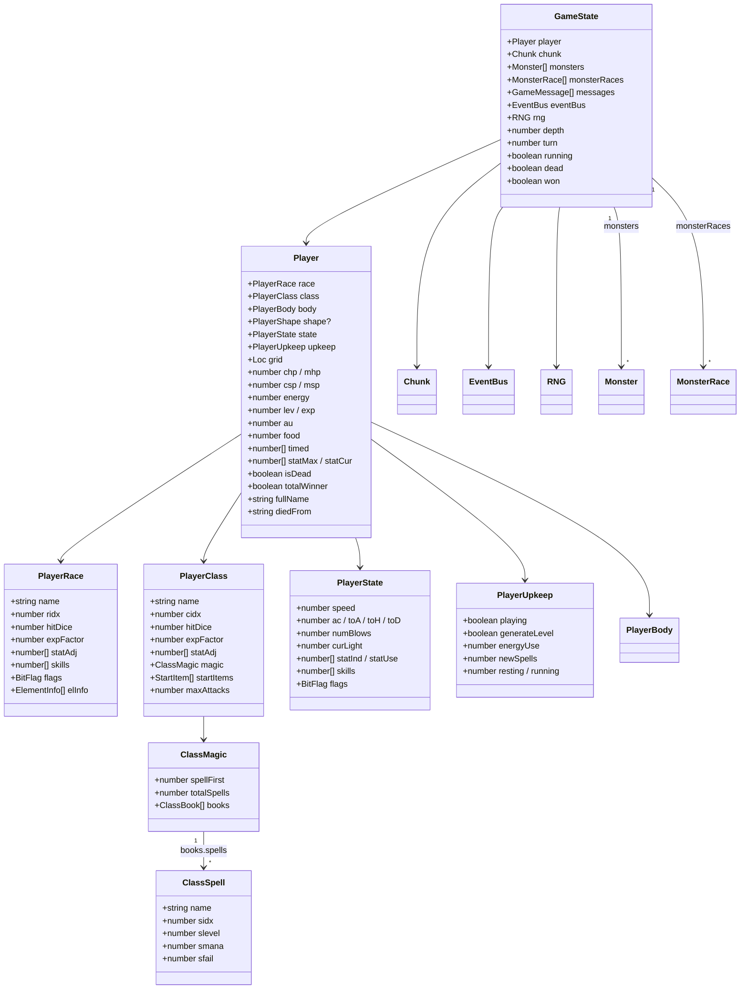

### 1-2. モンスター型関係図

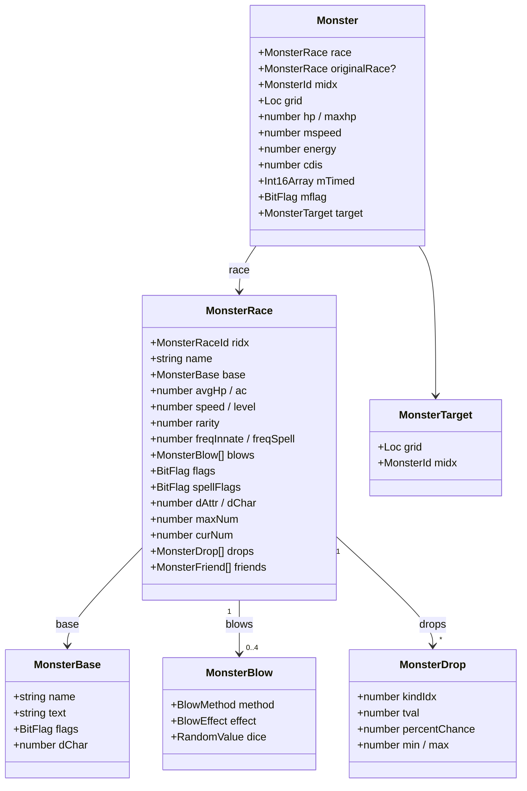

### 1-3. ダンジョン（Chunk/Square）型関係図

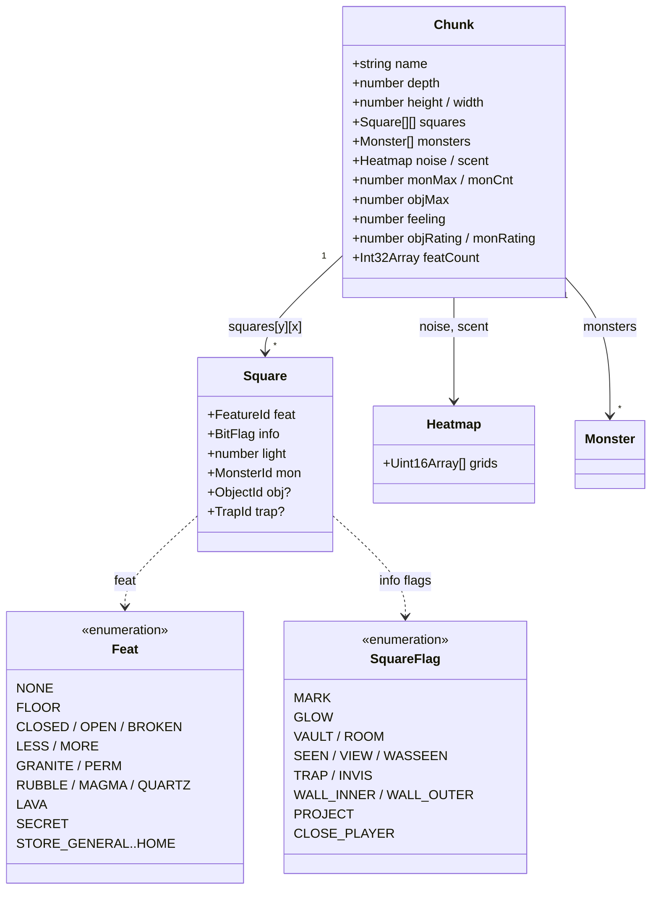

### 1-4. Web UIレイヤー クラス図

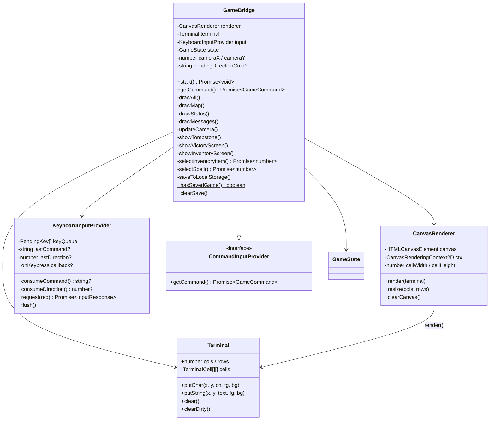

### 1-5. コマンドシステム型関係図

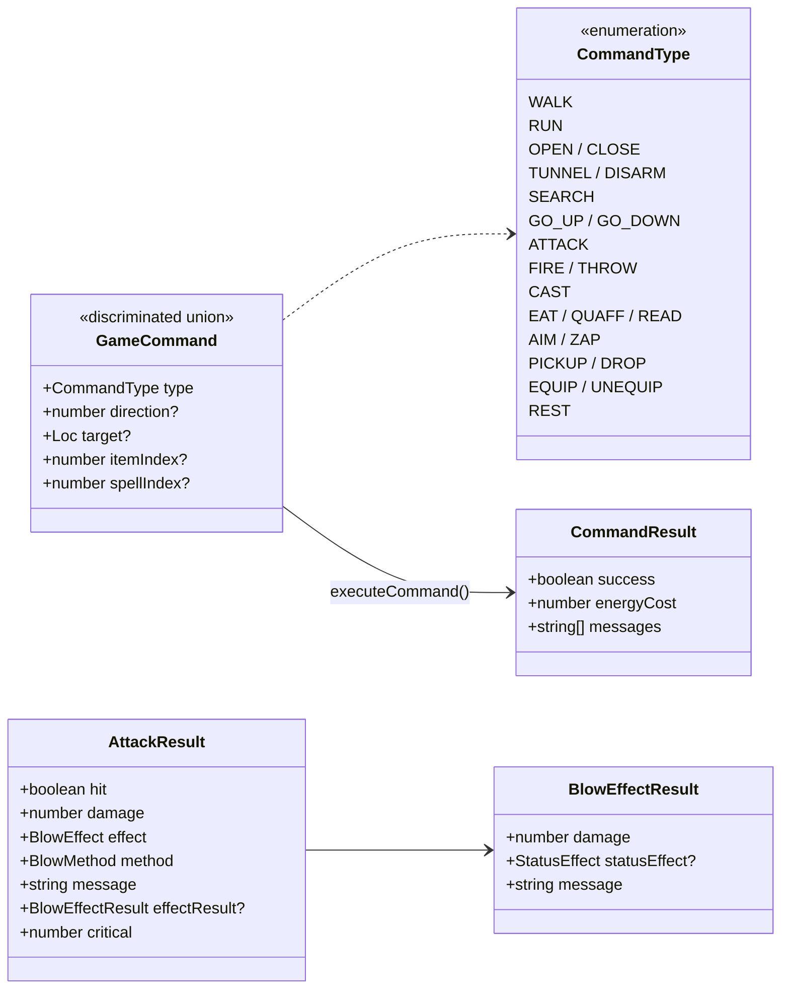

---

## 2. シーケンス図

### 2-1. メインゲームループ（1ターンの流れ）

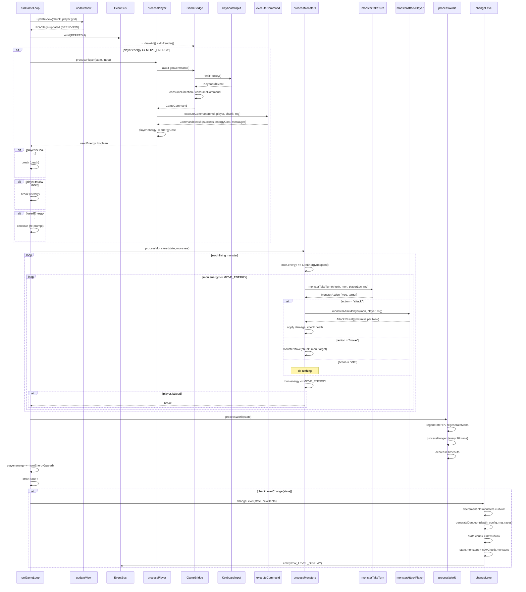

### 2-2. 起動〜ゲーム開始シーケンス

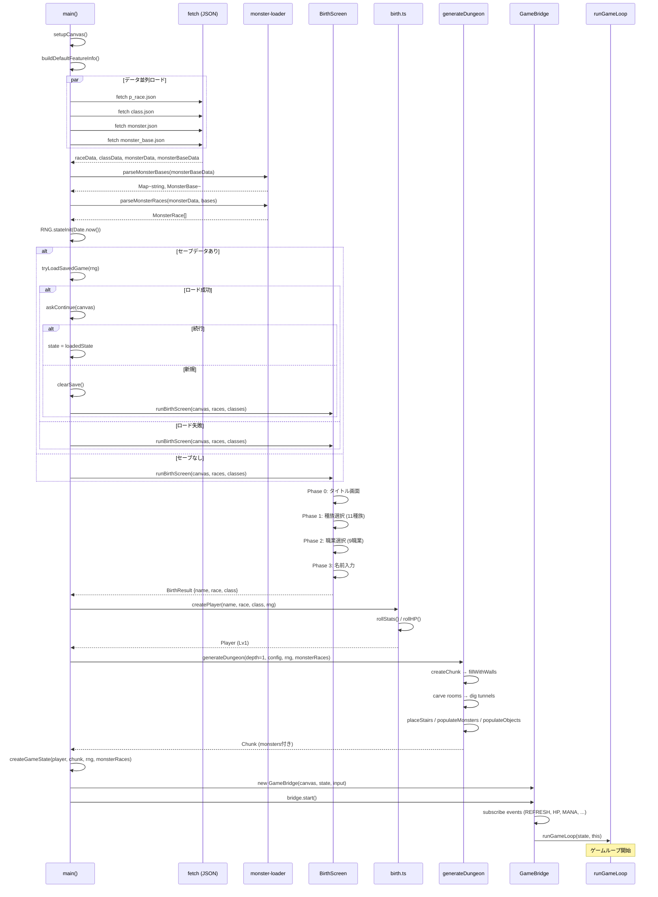

### 2-3. モンスター近接攻撃シーケンス

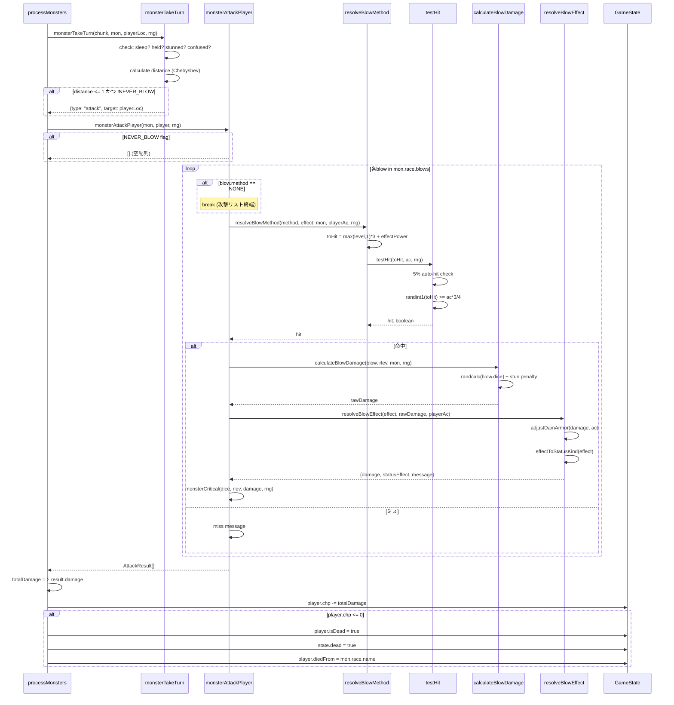

### 2-4. ダンジョン生成シーケンス

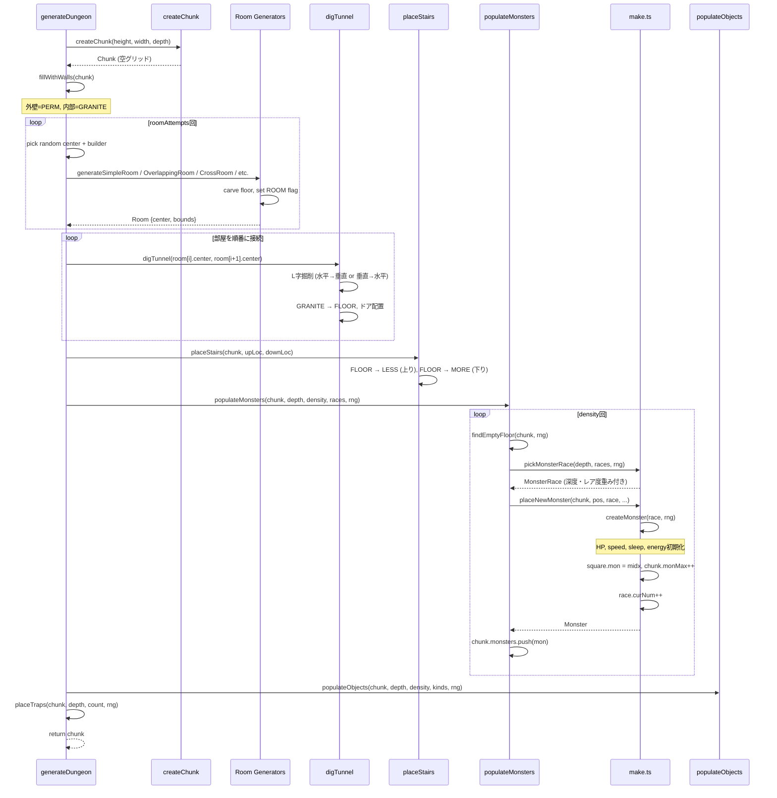

---

## 3. 状態遷移図

### 3-1. ゲーム全体の状態遷移

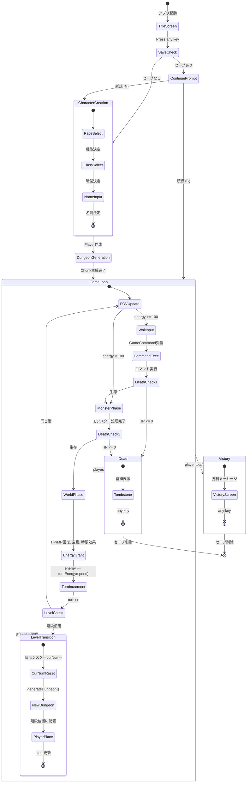

### 3-2. モンスターAI 状態遷移

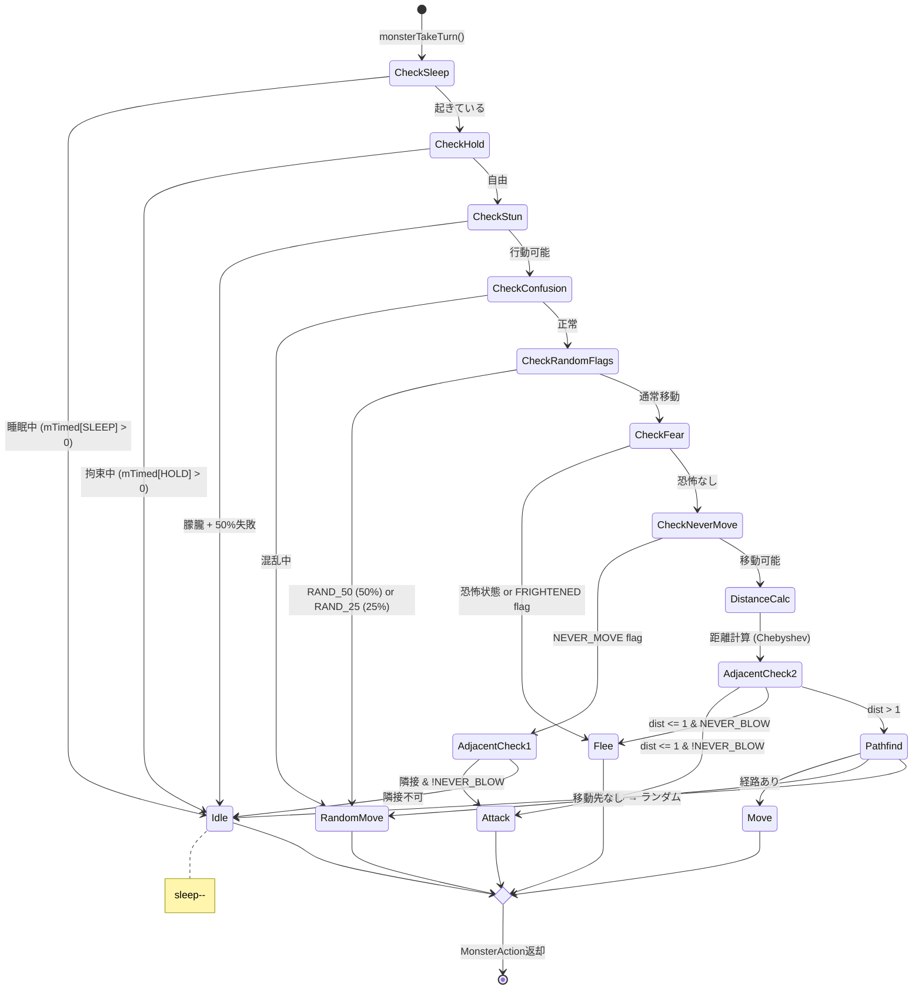

### 3-3. プレイヤーコマンド入力 状態遷移

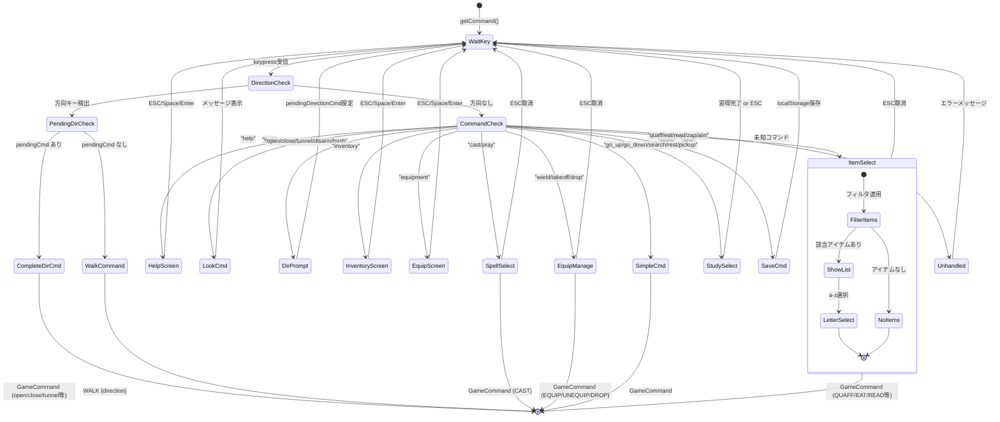

### 3-4. エネルギーシステム状態遷移

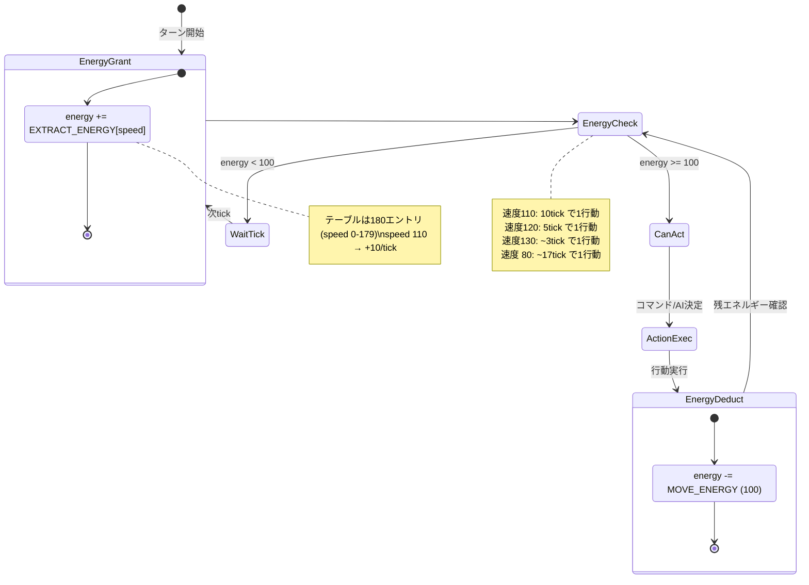

### 3-5. セーブ/ロード状態遷移

---

## 4. パッケージ構成図

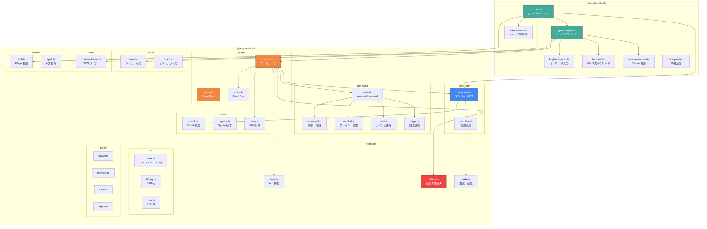
