# Angband-TS Architecture Diagrams

## 1. Class Diagrams (Types & Interface Relationships)

### 1-1. Core Entity Relationship Diagram

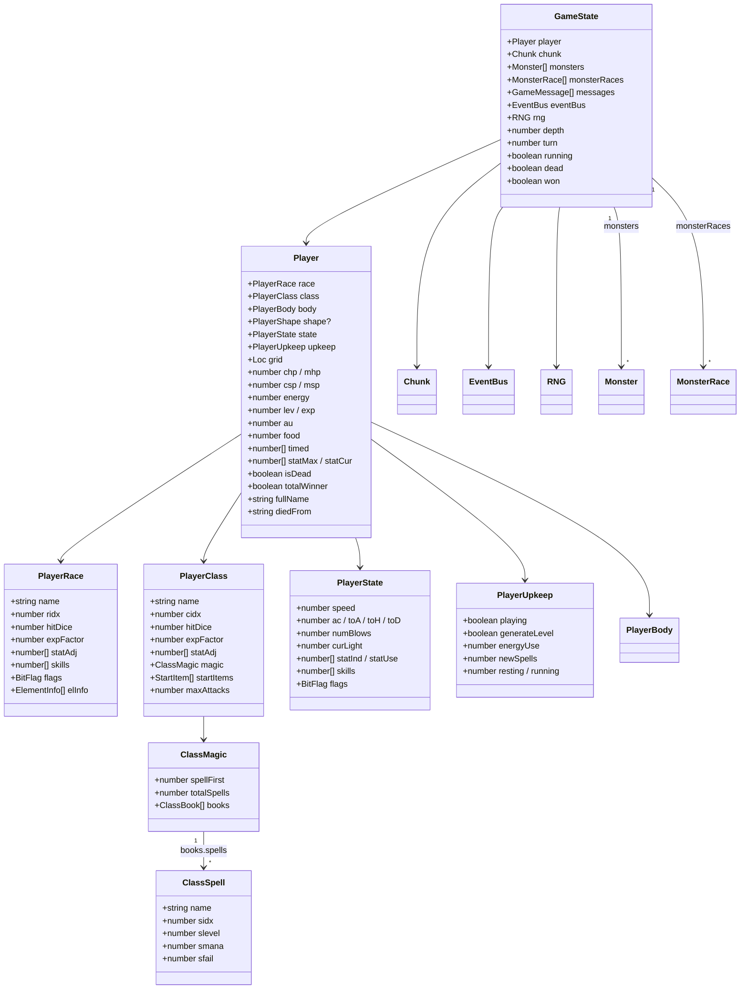

### 1-2. Monster Type Relationship Diagram

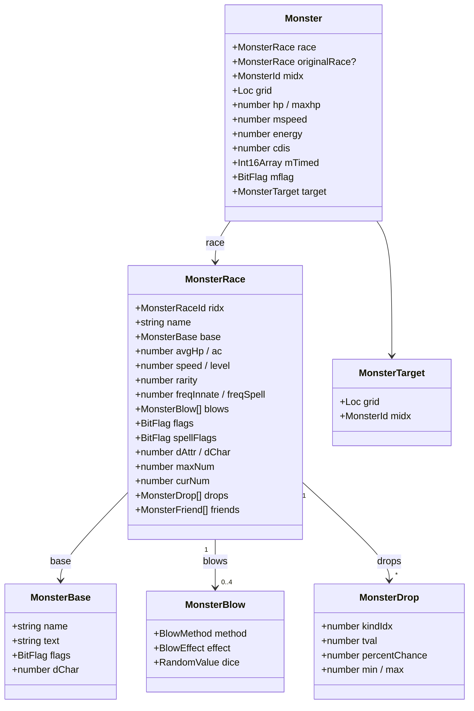

### 1-3. Dungeon (Chunk/Square) Type Relationship Diagram

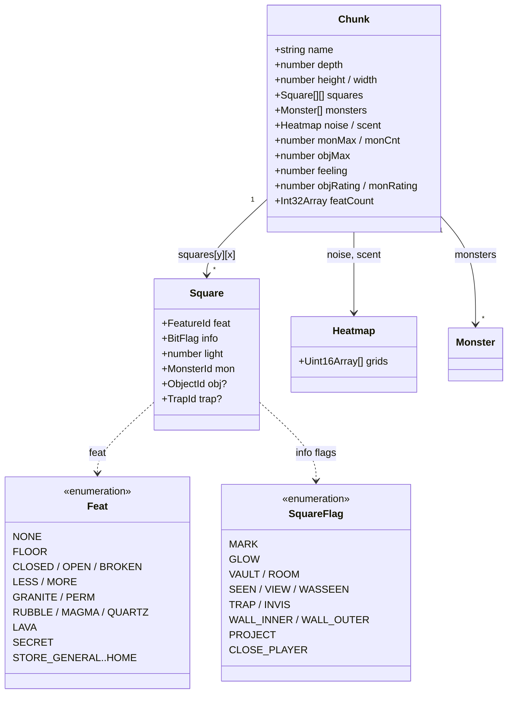

### 1-4. Web UI Layer Class Diagram

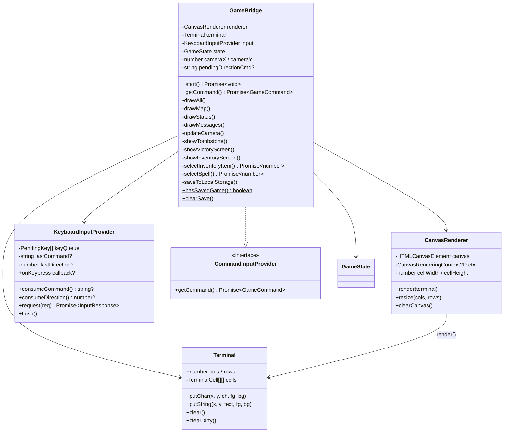

### 1-5. Command System Type Relationship Diagram

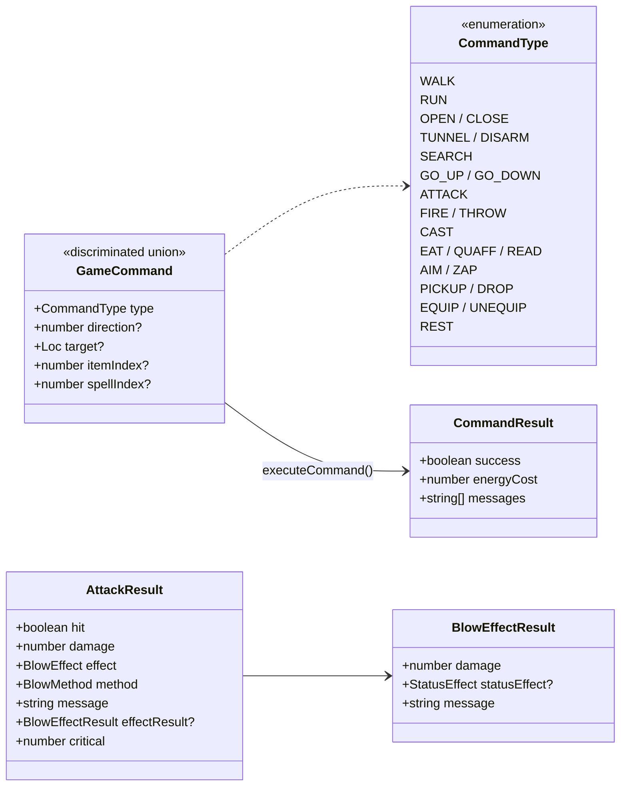

---

## 2. Sequence Diagrams

### 2-1. Main Game Loop (Flow of One Turn)

### 2-2. Startup to Game Start Sequence

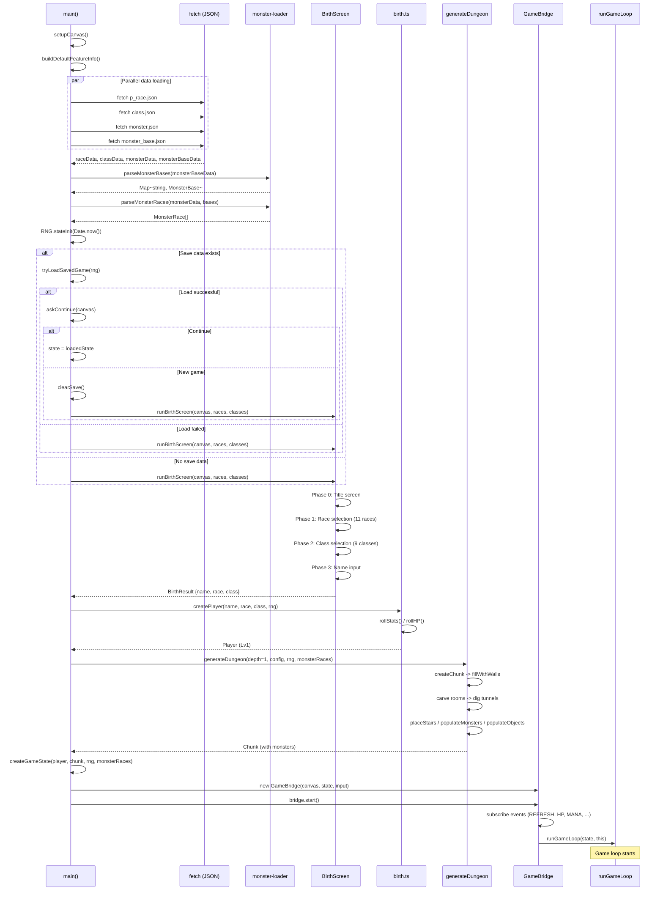

### 2-3. Monster Melee Attack Sequence

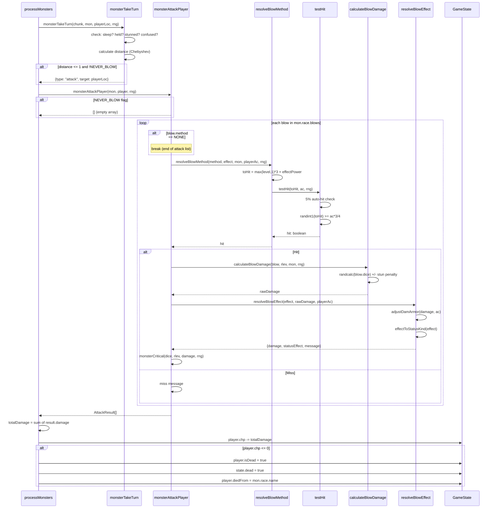

### 2-4. Dungeon Generation Sequence

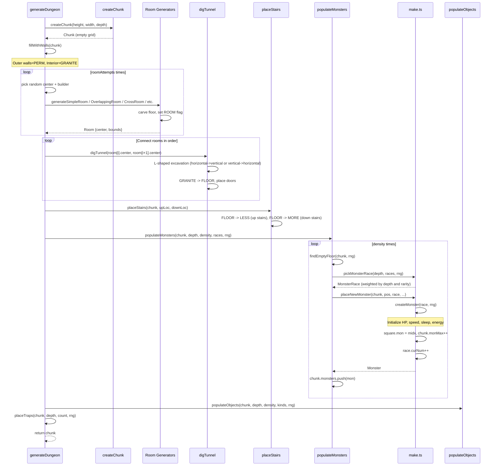

---

## 3. State Transition Diagrams

### 3-1. Overall Game State Transitions

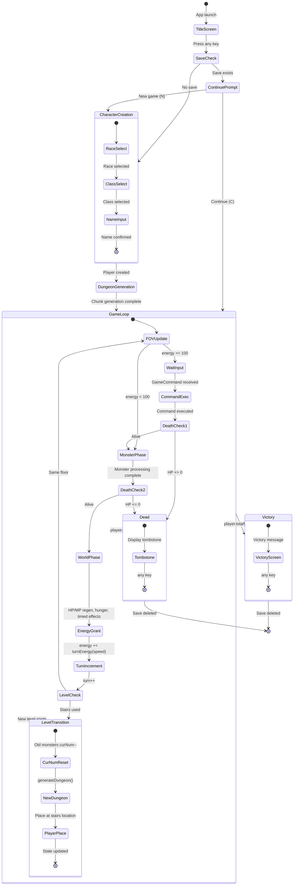

### 3-2. Monster AI State Transitions

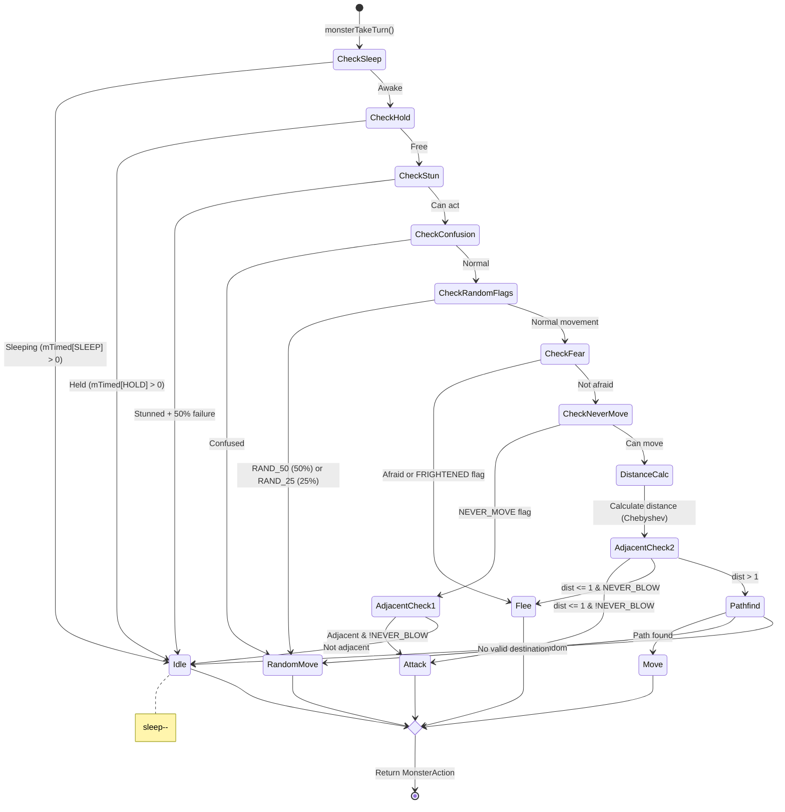

### 3-3. Player Command Input State Transitions

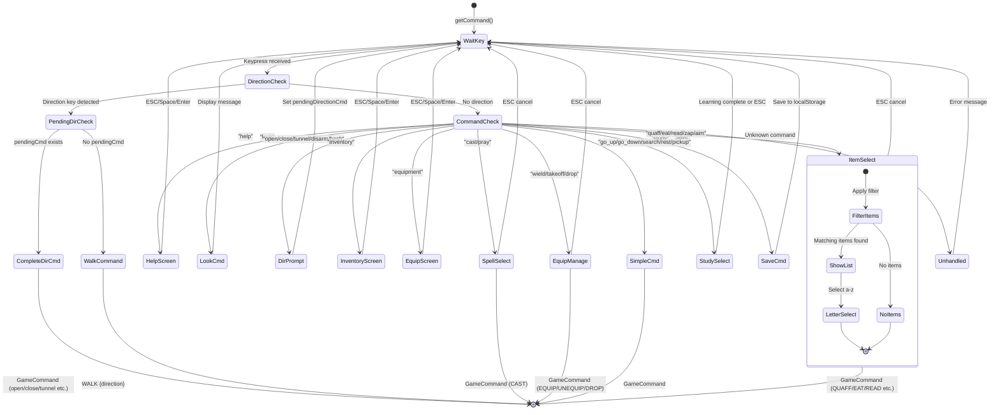

### 3-4. Energy System State Transitions

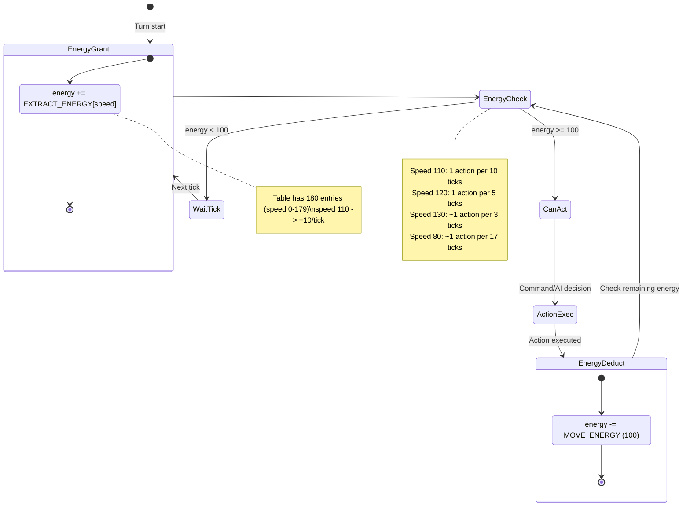

### 3-5. Save/Load State Transitions

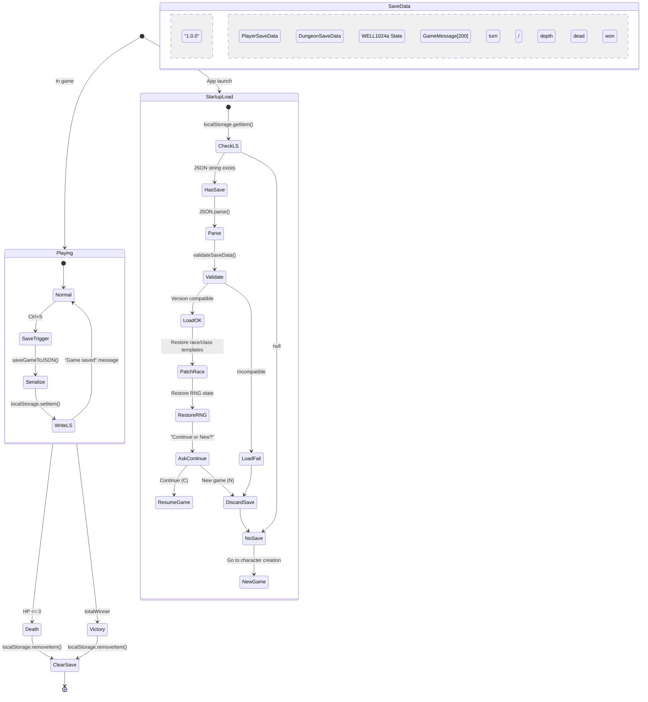

---

## 4. Package Structure Diagram

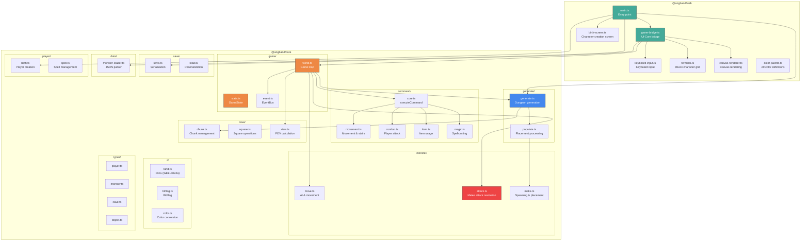
