# Angband (Original C版) アーキテクチャ図

> オリジナルC言語版Angband (`/Users/ishikawayuuki/Projects/angband/src/`) のMermaid記法によるアーキテクチャ図。
> TS版は `ARCHITECTURE.md` を参照。

---

## 目次

1. [クラス図（構造体）](#1-クラス図構造体)
2. [シーケンス図](#2-シーケンス図)
3. [状態遷移図](#3-状態遷移図)
4. [モジュール構成図](#4-モジュール構成図)

---

## 1. クラス図（構造体）

### 1.1 プレイヤー関連構造体

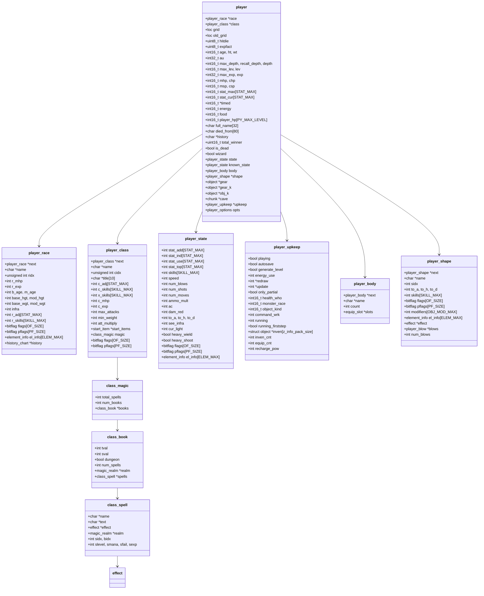

### 1.2 モンスター関連構造体

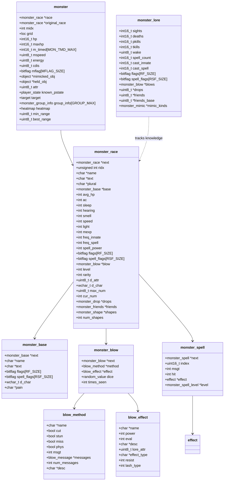

### 1.3 ダンジョン/洞窟構造体

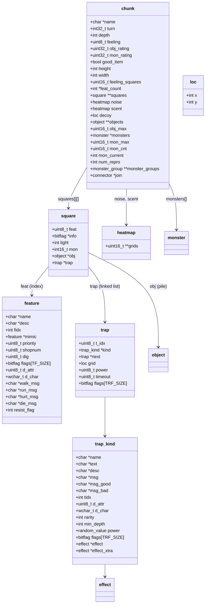

### 1.4 オブジェクト（アイテム）関連構造体

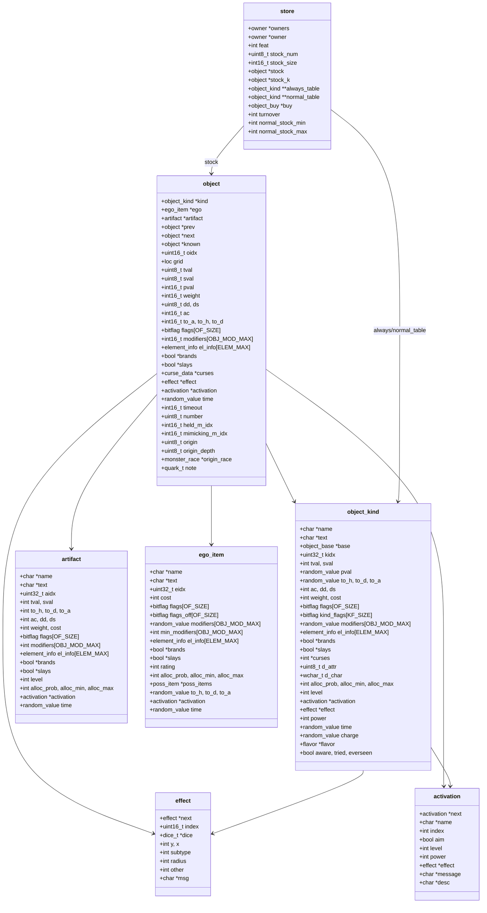

### 1.5 コマンドシステム構造体

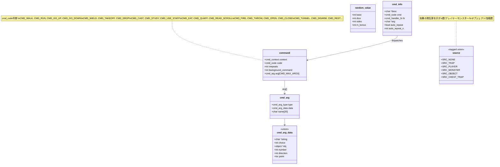

---

## 2. シーケンス図

### 2.1 メインゲームループ

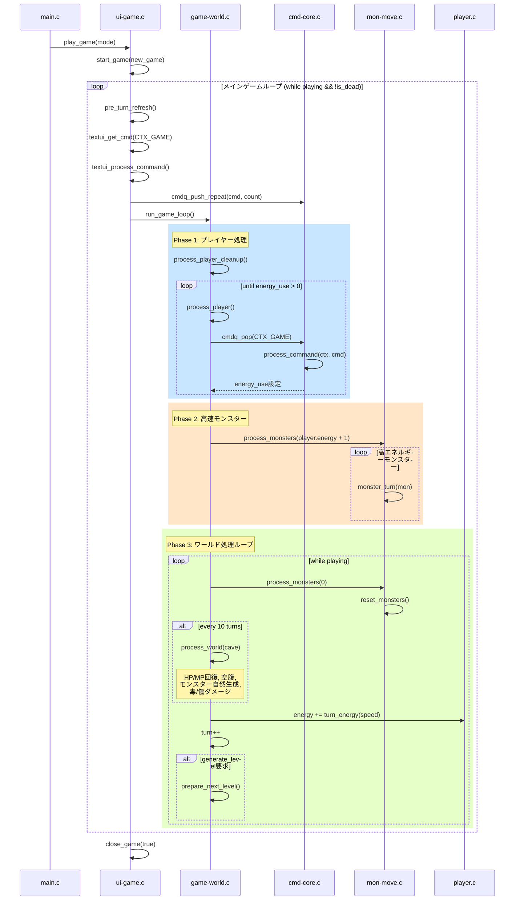

### 2.2 コマンド入力〜実行フロー

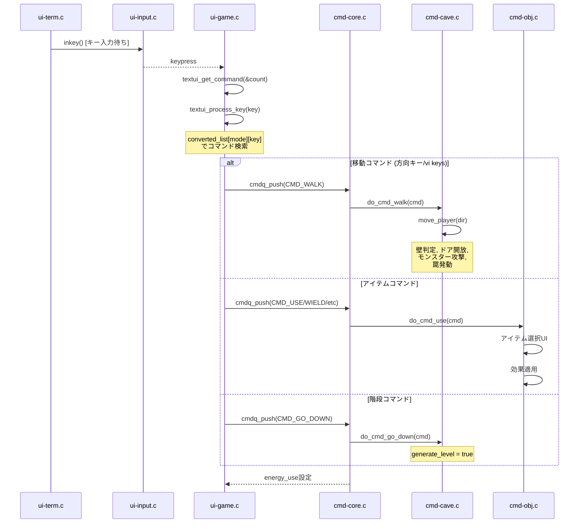

### 2.3 モンスターAI処理フロー

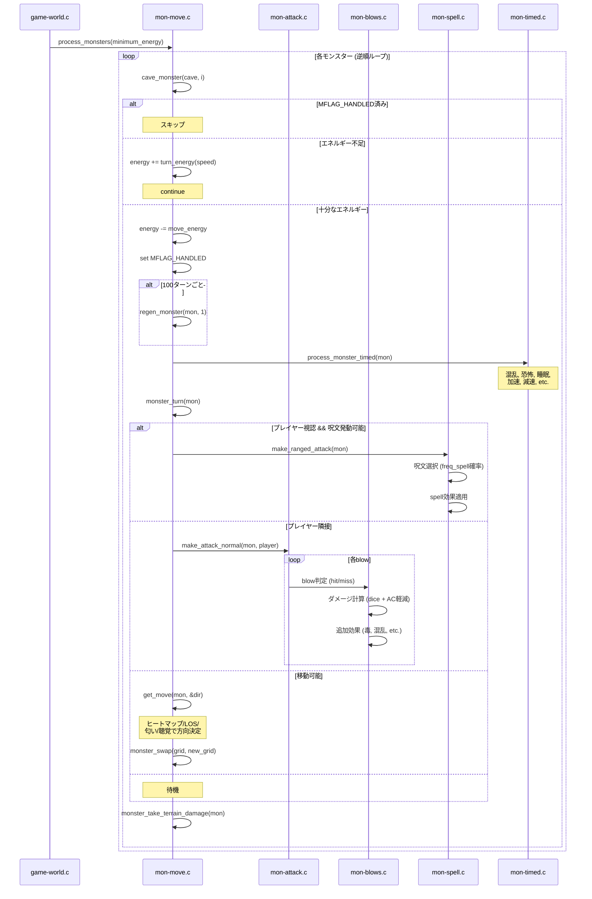

### 2.4 ダンジョン生成フロー

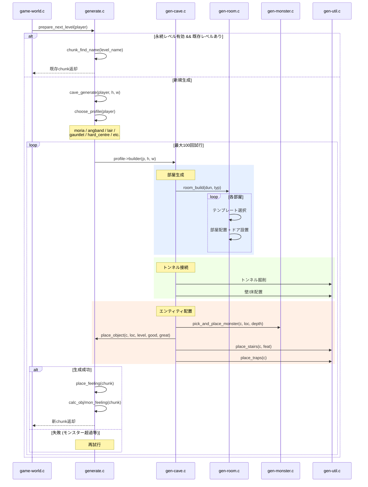

### 2.5 セーブ/ロード フロー

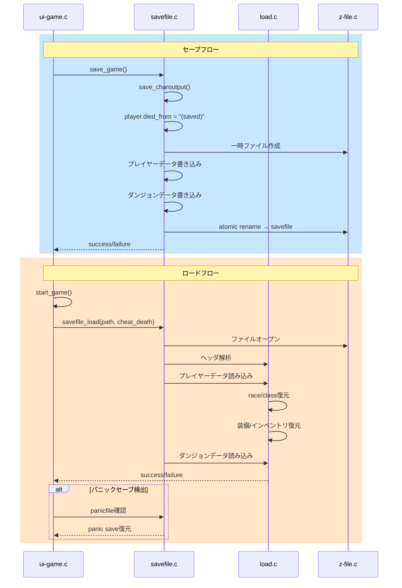

### 2.6 キャラクター作成（Birth）フロー

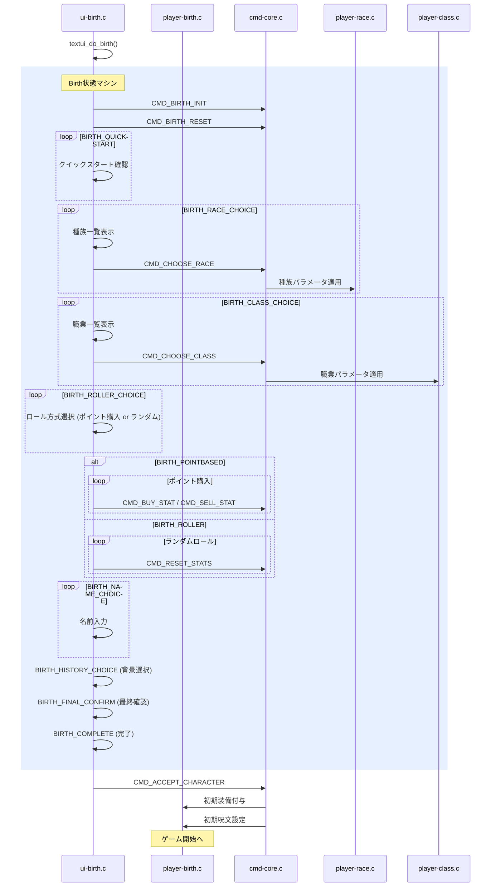

---

## 3. 状態遷移図

### 3.1 ゲーム全体の状態遷移

```mermaid
stateDiagram-v2
    [*] --> Init : main()起動

    Init --> Birth : 新規ゲーム
    Init --> LoadSave : セーブファイル存在
    Init --> PanicRecover : パニックセーブ検出

    LoadSave --> GameLoop : ロード成功
    LoadSave --> Birth : ロード失敗/新規選択
    PanicRecover --> GameLoop : 復元成功

    Birth --> RaceSelect
    RaceSelect --> ClassSelect
    ClassSelect --> StatRoll
    StatRoll --> HistorySelect
    HistorySelect --> Confirm
    Confirm --> RaceSelect : やり直し
    Confirm --> GameLoop : CMD_ACCEPT_CHARACTER

    state GameLoop {
        [*] --> PreTurnRefresh

        PreTurnRefresh --> WaitInput : 画面更新完了
        WaitInput --> ProcessCommand : キー入力受信
        ProcessCommand --> PlayerTurn : コマンドキュー処理

        state PlayerTurn {
            [*] --> ExecuteCommand
            ExecuteCommand --> CheckEnergy
            CheckEnergy --> ExecuteCommand : energy_use == 0 (無料行動)
            CheckEnergy --> [*] : energy_use > 0
        }

        PlayerTurn --> MonsterPhase : プレイヤー行動完了

        state MonsterPhase {
            [*] --> HighEnergyMonsters
            HighEnergyMonsters --> AllMonsters
            AllMonsters --> ResetFlags
            ResetFlags --> [*]
        }

        MonsterPhase --> WorldPhase

        state WorldPhase {
            [*] --> CheckTurn
            CheckTurn --> ProcessWorld : turn % 10 == 0
            CheckTurn --> GiveEnergy : else
            ProcessWorld --> GiveEnergy
            GiveEnergy --> AdvanceTurn
            AdvanceTurn --> [*]
        }

        WorldPhase --> CheckLevelChange
        CheckLevelChange --> GenerateLevel : generate_level == true
        CheckLevelChange --> PreTurnRefresh : same level
        GenerateLevel --> PreTurnRefresh
    }

    GameLoop --> Death : player.is_dead
    GameLoop --> Victory : total_winner
    GameLoop --> SaveQuit : セーブ & 終了

    Death --> DeathScreen : 墓碑表示
    DeathScreen --> HighScore : スコア記録
    HighScore --> [*]

    Victory --> VictoryScreen
    VictoryScreen --> HighScore

    SaveQuit --> [*]
```

### 3.2 モンスターAI状態遷移

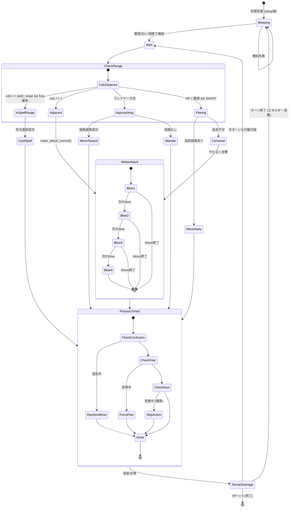

### 3.3 エネルギーシステム

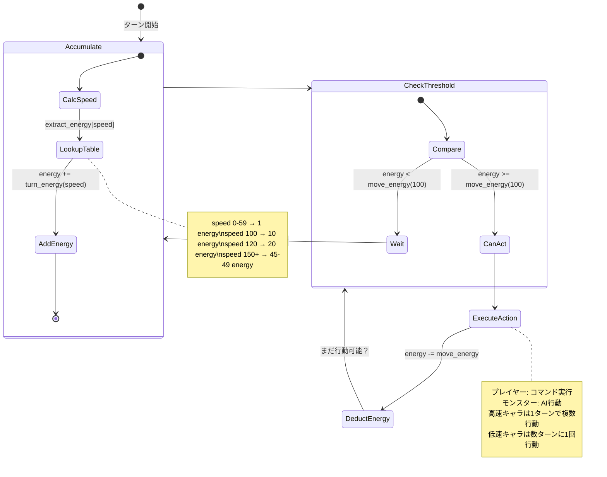

### 3.4 プレイヤー入力処理の状態遷移

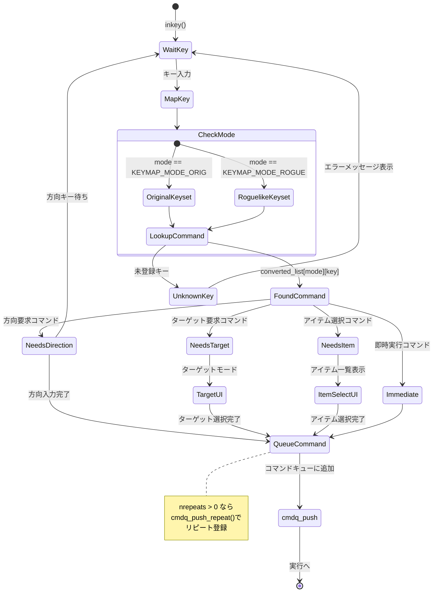

### 3.5 投射（Projection）処理の状態遷移

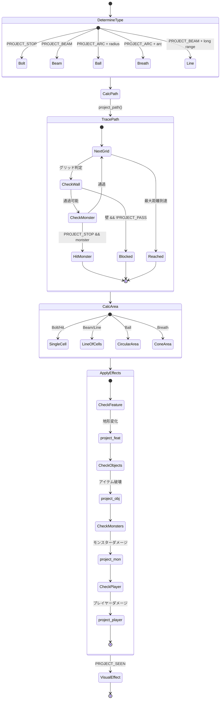

---

## 4. モジュール構成図

### 4.1 アーキテクチャレイヤー

```mermaid
graph TB
    subgraph "UI Layer (40 files)"
        UIBirth[ui-birth.c]
        UIGame[ui-game.c]
        UIDisplay[ui-display.c]
        UIMap[ui-map.c]
        UIStore[ui-store.c]
        UIMenu[ui-menu.c]
        UIInput[ui-input.c]
        UIOther[ui-*.c (30+ files)]
    end

    subgraph "Game Logic Layer"
        CmdCore[cmd-core.c<br/>コマンドキュー&ディスパッチ]
        CmdCave[cmd-cave.c<br/>移動/地形コマンド]
        CmdObj[cmd-obj.c<br/>アイテムコマンド]
        CmdMisc[cmd-misc.c<br/>休憩/探索等]
        Effects[effects.c<br/>エフェクト処理]
        Project[project.c<br/>投射/範囲処理]
    end

    subgraph "Game State Layer"
        Player[player.c<br/>プレイヤー状態]
        PlayerCalcs[player-calcs.c<br/>ステータス計算]
        Monster["mon-*.c (15 files)<br/>モンスターAI/攻撃/移動"]
        Object["obj-*.c (17 files)<br/>アイテム生成/管理"]
        Cave["cave*.c (4 files)<br/>ダンジョン/視界"]
        Store[store.c<br/>ショップ]
    end

    subgraph "World Management"
        GameWorld[game-world.c<br/>ゲームループ/ターン管理]
        Generate["gen-*.c (5 files)<br/>ダンジョン生成"]
        SaveLoad[save.c / load.c<br/>セーブ/ロード]
    end

    subgraph "Event System"
        GameEvent[game-event.c<br/>Pub/Subイベント]
    end

    subgraph "Terminal Abstraction"
        UITerm[ui-term.c<br/>仮想ターミナル]
    end

    subgraph "Platform Frontends"
        MainGCU[main-gcu.c<br/>NCurses]
        MainSDL[main-sdl2.c<br/>SDL2]
        MainX11[main-x11.c<br/>X11]
        MainWin[main-win.c<br/>Windows]
        MainNDS[main-nds.c<br/>NDS]
    end

    subgraph "Data Loading"
        Parser[parser.c<br/>汎用パーサー]
        Datafile[datafile.c<br/>データファイル読込]
        Init[init.c<br/>初期化/全データ読込]
    end

    subgraph "Z-Layer Utilities (13 files)"
        ZRand[z-rand.c<br/>乱数生成]
        ZVirt[z-virt.c<br/>メモリ管理]
        ZFile[z-file.c<br/>ファイルI/O]
        ZDice[z-dice.c<br/>ダイス式]
        ZOther[z-*.c (9 files)]
    end

    UIGame --> CmdCore
    UIGame --> GameWorld
    CmdCore --> CmdCave
    CmdCore --> CmdObj
    CmdCore --> CmdMisc
    CmdCave --> Player
    CmdCave --> Cave
    CmdObj --> Object
    CmdObj --> Effects
    Effects --> Project
    GameWorld --> Monster
    GameWorld --> Generate
    GameWorld --> Player
    GameEvent -.-> UIDisplay
    GameEvent -.-> UIMap
    UITerm --> MainGCU
    UITerm --> MainSDL
    UITerm --> MainX11
    UITerm --> MainWin
    Init --> Parser
    Init --> Datafile
    Monster --> Cave
    Object --> ZDice
    Generate --> Cave
```

### 4.2 モジュールファイル分類

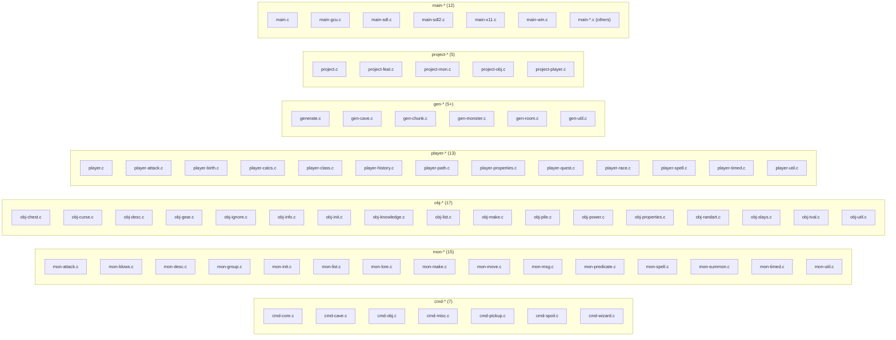

### 4.3 データ駆動アーキテクチャ

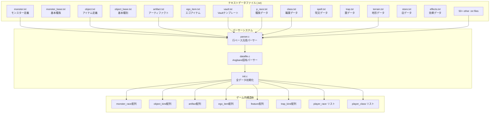

---

## 付録: C版 vs TS版 主要な設計差異

| 観点 | C版 (Original) | TS版 (Port) |
|------|----------------|-------------|
| **状態管理** | グローバル変数 (`player`, `cave`, `turn`) | `GameState`オブジェクト（集約） |
| **関数ディスパッチ** | 関数ポインタ + コマンドキュー | async/await + switch文 |
| **イベントシステム** | `game-event.c` (C関数ポインタ) | `EventBus` (TypeScript) |
| **UI抽象化** | `ui-term.c` (仮想ターミナル + フロントエンド) | `Terminal` class (Canvas直接描画) |
| **プラットフォーム** | Curses / SDL2 / X11 / Windows / NDS | Webブラウザ (Canvas) |
| **データ読込** | テキスト `.txt` ファイル + 行パーサー | JSON ファイル + TypeScript import |
| **乱数** | WELL512a (`z-rand.c`) | カスタムRNG (`rand.ts`) |
| **メモリ管理** | `z-virt.c` (手動malloc/free) | GC (JavaScript自動管理) |
| **セーブ形式** | バイナリ savefile | JSON → localStorage |
| **ファイル数** | 164 .c + 168 .h = 332 files | 97 .ts source + 54 .test.ts files |
| **視界(FOV)** | `cave-view.c` (整数ベースBresenham) | `view.ts` (Symmetric Shadowcasting, 実装済み) |
| **モンスターAI** | ヒートマップ + 匂い + 聴覚 + 個別flow | チャンクレベル音/匂いBFS + 距離ベース (heatmap.ts 実装済み) |
| **投射(Projection)** | `project.c` (完全実装 bolt/beam/ball/breath) | `project.ts` (コア実装済、UIアニメーション未対応) |
| **呪文システム** | データファイル駆動 + `effect`チェーン | エフェクト35/119実装、spell-flagsデータ未パース |
| **ショップ** | 完全実装（8店舗 + 自宅） | store.ts コア完成、町マップ/UI未接続 |
